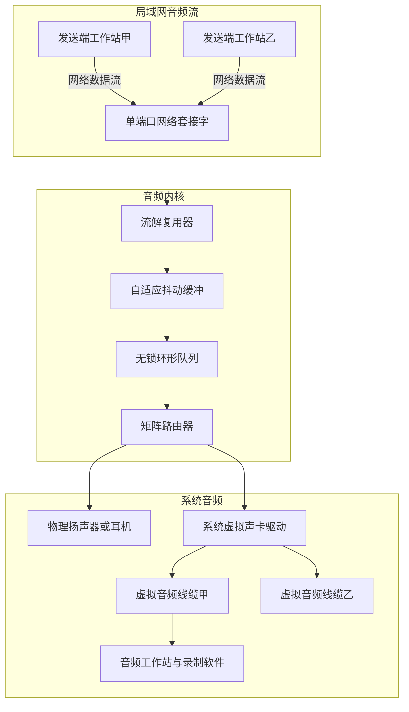

<div align="center">


# VBAN Ultimate for macOS


*专为 Apple Silicon 架构量身打造的高性能广播级网络音频路由矩阵与虚拟音频线缆工作台*

[English](README_EN.md) · [简体中文](README.md)

[](https://apple.com/macos)
[](https://apple.com)
[](Core/)
[](App/)

</div>

---

VBAN Ultimate 是专为苹果电脑打造的专业网络音频与虚拟线缆工具。软件在标准网络音频端口实现多路音频流的全双工零拷贝解复用与并发发送，并与系统音频硬件抽象层深度打通，提供动态可配置的系统虚拟声卡与广播级路由矩阵。

---

## 快速开始

如果正在使用具备终端执行能力的智能编程助手，可以直接向其发送以下指令：

```text
帮我安装这个仓库：检查 macOS 环境与 Xcode 命令行工具，编译并签名 VBAN Ultimate，安装 CoreAudio 虚拟音频驱动，并将应用固化部署到 /Applications。
```

> [!TIP]
> 智能代理将自动执行环境检测、调用内置编译脚本、完成驱动注册并配置权限，免去手动输入多条命令。

---

## 传统开始

### 方式一：下载预编译安装镜像

1. 前往发布页面下载最新的安装镜像文件。
2. 双击打开镜像，将应用程序图标拖入应用程序文件夹。
3. 若需要使用虚拟音频线缆功能，请在终端中运行一次驱动安装脚本：
   ```zsh
   sudo ./Scripts/install_driver.zsh
   ```

### 方式二：从源码编译与安装

克隆仓库后，通过终端执行自动化脚本完成构建与部署：

```zsh
# 1. 编译系统虚拟音频驱动
./Scripts/build_driver.zsh

# 2. 安装驱动至系统目录，需要管理员权限
sudo ./Scripts/install_driver.zsh

# 3. 编译并签名原生应用程序
./Scripts/build_app.zsh

# 4. 固化安装至系统应用程序目录
cp -R build/VBANUltimate.app /Applications/
```

---

## 特性

- 单端口全双工复用：遵循官方标准网络协议端口，单个网络接口完成多路音频流零拷贝解复用与发送。
- 专业音频路由矩阵：点对点数学对齐画布，单格尺寸九十六点，支持单目标输出源互斥切换与广播级一对多分发。
- 原生虚拟音频线缆：自主研发系统级音频插件驱动，在系统原生配置工具中完全可见，参数热更新无需重启系统音频服务。
- 双列声场横向电平表：支持多种声道立体声场左右对称排布，五十赫兹真实物理能量驱动，静音状态显示负无穷分贝。
- 微秒级抖动诊断与吸收：多级自适应抖动缓冲区，无锁环形队列，实时呈现吞吐带宽、丢包与微秒抖动指标。
- 智能端口冲突接管：遭遇外部程序占用标准端口时拒绝静默降级，原生窗口支持一键安全排查并接管端口。
- 原生深色双语界面：纯原生开发，严格遵循暗调工业美学规范，支持中文与英文专业术语即时热切换。

---

## 系统架构



---

## 系统要求

- 操作系统：macOS 13.0 或更高版本。
- 硬件架构：Apple Silicon M1 及以上芯片。
- 开发工具：Xcode 命令行工具，包含编译器 clang++ 与 swiftc。

---

## 验证与测试

工程提供完备的端到端自动化测试集，覆盖协议解析、网络并发、环形队列与系统硬件枚举：

```zsh
# 协议解析与数据边界测试
clang++ -std=c++20 -O2 Tests/TestVBANParser.cpp -o bin/test_vban_parser && ./bin/test_vban_parser

# 本地多流网络回环测试
clang++ -std=c++20 -O2 Tests/TestNetworkLoopback.cpp -o bin/test_network_loopback && ./bin/test_network_loopback

# 无锁环形队列并发测试
clang++ -std=c++20 -O2 Tests/TestRingBuffer.cpp -o bin/test_ring_buffer && ./bin/test_ring_buffer

# 系统声卡枚举测试
clang++ -std=c++20 -O2 -framework CoreAudio -framework CoreFoundation Tests/TestAudioDeviceCatalog.cpp -o bin/test_device_catalog && ./bin/test_device_catalog

# 正弦波音频还原重建测试
clang++ -std=c++20 -O2 Tests/TestAudioLoopback.cpp -o bin/test_audio_loopback && ./bin/test_audio_loopback

# 虚拟音频线缆生命周期与存储测试
clang++ -std=c++20 -O2 -framework CoreAudio -framework CoreFoundation Tests/TestCableManager.cpp -o bin/test_cable_manager && ./bin/test_cable_manager

# 矩阵路由分发与增益测试
clang++ -std=c++20 -O2 -framework CoreAudio -framework CoreFoundation Tests/TestMatrixRouter.cpp -o bin/test_matrix_router && ./bin/test_matrix_router
```
