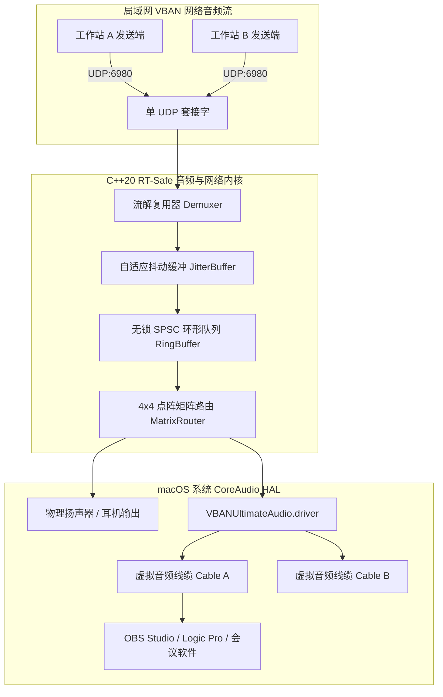

<div align="center">


# VBAN Ultimate for macOS


*专为 Apple Silicon 量身打造的原生轻量、超低延迟广播级 VBAN 音频路由矩阵与 CoreAudio 虚拟音频线缆工作台*

[English](README_EN.md) · [简体中文](README.md)

[](https://apple.com/macos)
[-orange.svg?style=flat-square)](https://apple.com)
[](Core/)
[](App/)

</div>

---

**VBAN Ultimate** 是专为 macOS 打造的高性能广播级网络音频与虚拟音频线缆工作台。它在单个标准 UDP 6980 套接字上实现了多路 VBAN 网络音频流的全双工零拷贝解复用与并发发送，并与 macOS CoreAudio 系统硬件抽象层深度打通，提供动态可热配置的系统级虚拟声卡与广播级路由矩阵。

---

## 快速开始

如果你正在使用具备终端执行能力的 AI 编程助手（如 Antigravity、Claude Code、Cursor 或 Codex），你可以直接向它发送以下提示词：

```text
帮我安装这个仓库：检查 macOS 环境与 Xcode 命令行工具，编译并签名 VBAN Ultimate，安装 CoreAudio 虚拟音频驱动，并将应用固化部署到 /Applications。
```

> [!TIP]
> AI 代理将自动执行环境检查、调用工程内置的编译脚本、完成驱动注册并配置权限，免去手动输入多条命令的繁琐步骤。

---

## 传统开始

### 方式一：下载预编译发布包（推荐）

1. 前往 [Releases](https://github.com/yourpapayouknow/VbanUltimateforiwmei/releases) 页面下载最新的 `VBANUltimate-v1.0.0-macOS-arm64.dmg`。
2. 双击打开镜像，将 `VBANUltimate.app` 拖入 `Applications`（应用程序）文件夹。
3. 若需要使用系统虚拟音频线缆（Virtual Cable），请在终端中运行驱动安装脚本一次：
   ```zsh
   sudo ./Scripts/install_driver.zsh
   ```

### 方式二：从源码编译与安装

克隆仓库后，通过终端执行纯脚本构建与部署：

```zsh
# 1. 编译系统级 CoreAudio HAL 虚拟音频驱动
./Scripts/build_driver.zsh

# 2. 安装驱动至系统目录（需要管理员权限）
sudo ./Scripts/install_driver.zsh

# 3. 编译并签名原生应用程序
./Scripts/build_app.zsh

# 4. 固化安装至系统应用目录
cp -R build/VBANUltimate.app /Applications/
```

---

## 特性

- **单端口全双工复用**：严格遵循官方 UDP 6980 协议端口，单个套接字完成多路音频流零拷贝解复用与发送。
- **4x4 点阵专业音频路由矩阵**：点对点数学对齐画布（$4 \times 24 = 96\text{pt}$），支持单目标输出源互斥切换与广播级一对多分发（Fan-out）。
- **CoreAudio HAL 原生虚拟音频线缆**：自主研发系统级 `AudioServerPlugIn` 驱动，在系统“音频与MIDI设置”中原生可见，参数热更新无需重启系统守护进程。
- **双列声场横向电平表**：支持 1CH/2CH/4CH/6CH/8CH 声道立体声场左右对称排布，50Hz 真实物理能量驱动，静音基线标准 `-∞ dB`。
- **微秒级抖动诊断与自适应吸收**：多级自适应抖动缓冲区，无锁 SPSC 环形队列，实时呈现吞吐带宽、丢包与微秒抖动指标。
- **智能端口冲突接管**：遭遇外部程序独占 UDP 6980 时拒绝静默降级，原生深色弹窗支持一键安全排查并接管端口。
- **原生深色双语界面**：SwiftUI 纯原生实现，严格遵循暗调工业美学规范，支持中文与英文专业术语即时热切换。

---

## 系统架构



---

## 系统要求

- **操作系统**：macOS 13.0 (Ventura) 或更高版本（深度支持 macOS 14 Sonoma 与 macOS 15 Sequoia）；
- **硬件架构**：Apple Silicon（`arm64`，针对 M1/M2/M3/M4 系列芯片原生优化）；
- **开发工具**：Xcode Command Line Tools（提供 `clang++` 与 `swiftc`）。

---

## 验证与测试

工程提供完备的端到端自动化测试集，覆盖协议解析、网络并发、环形队列与系统硬件枚举：

```zsh
# 协议解析与数据边界测试
clang++ -std=c++20 -O2 Tests/TestVBANParser.cpp -o bin/test_vban_parser && ./bin/test_vban_parser

# 本地多流 UDP 回环测试
clang++ -std=c++20 -O2 Tests/TestNetworkLoopback.cpp -o bin/test_network_loopback && ./bin/test_network_loopback

# 无锁 SPSC 环形队列并发测试
clang++ -std=c++20 -O2 Tests/TestRingBuffer.cpp -o bin/test_ring_buffer && ./bin/test_ring_buffer

# 系统硬件声卡枚举测试
clang++ -std=c++20 -O2 -framework CoreAudio -framework CoreFoundation Tests/TestAudioDeviceCatalog.cpp -o bin/test_device_catalog && ./bin/test_device_catalog

# 正弦波音频还原重建测试
clang++ -std=c++20 -O2 Tests/TestAudioLoopback.cpp -o bin/test_audio_loopback && ./bin/test_audio_loopback

# 虚拟音频线缆生命周期与存储测试
clang++ -std=c++20 -O2 -framework CoreAudio -framework CoreFoundation Tests/TestCableManager.cpp -o bin/test_cable_manager && ./bin/test_cable_manager

# 矩阵路由分发与增益测试
clang++ -std=c++20 -O2 -framework CoreAudio -framework CoreFoundation Tests/TestMatrixRouter.cpp -o bin/test_matrix_router && ./bin/test_matrix_router
```
