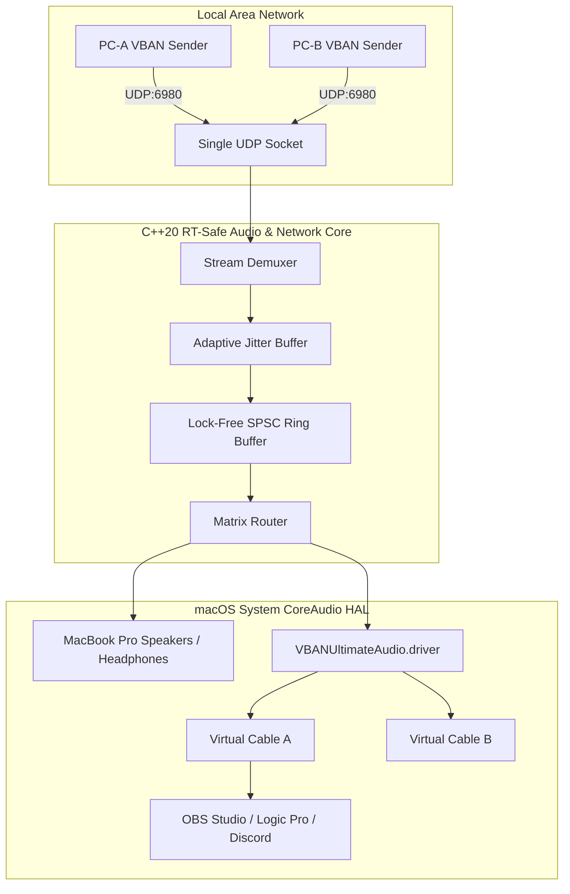

# VBAN Ultimate for macOS

> A lightweight, ultra-low-latency VBAN Audio Matrix & CoreAudio Dynamic Virtual Cable Manager built natively for macOS on Apple Silicon.

[]()
[-orange.svg?style=flat-square)]()
[]()
[]()

---

## Overview

**VBAN Ultimate** (`vbanultimateforiwmei`) is an infrastructure-grade audio utility that bridges **VBAN (VB-Audio Network)** network streaming and **macOS CoreAudio HAL**. It is purposefully engineered to fulfill three essential pillars without DAW bloat or unnecessary DSP overhead:

1. **Full VBAN Audio Matrix**: Full-duplex, multi-stream sending and receiving multiplexed over a single UDP socket.
2. **Dynamic Virtual Audio Cables**: A dedicated `AudioServerPlugIn` driver that exposes dynamic virtual input/output loopback cables on macOS without restarting `coreaudiod`.
3. **VBAN Talkie / Receptor Telemetry**: Complete real-time packet continuity, jitter absorption, bitrate calculation, and drop rate monitoring.



---

## Key Features

- **Single UDP Port Multi-Stream Demuxing**: Runs over standard UDP port `6980`, using zero-copy packet header parsing (`struct VBanHeader`, 28 bytes) to demultiplex streams by `streamname` and IP without spawning redundant network sockets.
- **Dynamic HAL Virtual Cables**: Employs `libASPL` and a atomic filesystem watcher on `/Library/Application Support/VBANUltimate/cables.plist`. Adding, renaming, or removing cables immediately broadcasts to CoreAudio and Audio MIDI Setup without killing or restarting the daemon.
- **RT-Safe Audio Pipeline**: CoreAudio rendering and capture callbacks are 100% lock-free, zero-allocation, and wait-free, relying on a cache-line aligned `RingBuf<float>` and power-of-two modulo addressing.
- **Micro-Jitter Absorption**: Multi-tiered Jitter Buffer (`Optimal` ~5ms, `Fast` ~10ms, `Normal` ~20ms, `Slow` ~40ms, `VerySlow` ~80ms) normalizes 8-bit, 16-bit, 24-bit, and 32-bit float samples smoothly.
- **De-cardified Professional Dark UI**: Crafted in SwiftUI according to the verified `DESIGN.md` specification. Features top segmented tabs, continuous squircle geometry, and monospace metric numbers (`.monospacedDigit()`) that eliminate visual jitter.

---

## System Architecture

```text
vbanultimateforiwmei/
├── App/                       # Swift & SwiftUI Native GUI
│   ├── Theme.swift            # Dark Professional Audio design tokens
│   ├── VBANUltimateApp.swift  # Main Application entry point
│   ├── ViewModels/            # AppModel (500ms throttled UI polling)
│   └── Views/                 # Overview, Streams, Matrix, Cables, Monitoring, Settings
├── Bridge/                    # Objective-C++ & C-ABI Glue Layer
│   ├── HeadBridge.h           # Unified bridge interface
│   ├── BridgeCore.mm          # Zero-copy bridge implementation
│   └── VBANUltimate-Bridging-Header.h
├── Core/                      # C++20 Core Audio & Network Logic
│   ├── Common/                # Head.hpp, Types.hpp, RingBuffer.hpp
│   ├── VBAN/                  # Protocol.hpp, Parser.hpp, Packetizer.hpp
│   ├── Network/               # UdpSocket.hpp, Demuxer.hpp, JitterBuffer.hpp
│   ├── Audio/                 # AudioEngine.hpp, DeviceCatalog.hpp, CableManager.hpp
│   ├── Routing/               # MatrixRouter.hpp
│   └── Monitoring/            # StreamStats.hpp, MetricsEngine.hpp
├── Driver/                    # Virtual Audio Driver (AudioServerPlugIn)
│   └── VirtualAudio/          # DriverEntry.cpp, Info.plist
├── Scripts/                   # Automated build & installation scripts
│   ├── build_driver.zsh       # Compiles VBANUltimateAudio.driver
│   ├── build_app.zsh          # Compiles VBANUltimate.app
│   ├── install_driver.zsh     # Installs driver to /Library/Audio/Plug-Ins/HAL/
│   └── uninstall_driver.zsh   # Uninstalls driver cleanly
├── Tests/                     # Automated unit and integration test suite
│   ├── TestVBANParser.cpp     # Protocol & edge case tests
│   ├── TestNetworkLoopback.cpp# UDP socket & multi-stream tests
│   ├── TestRingBuffer.cpp     # Lock-free SPSC concurrency tests
│   ├── TestAudioDeviceCatalog.cpp # Real system device query
│   ├── TestAudioLoopback.cpp  # Sine wave audio reconstruction test
│   ├── TestCableManager.cpp   # Cable lifecycle & plist persistence test
│   ├── TestMatrixRouter.cpp   # Matrix fanout & gain test
│   └── TestSwiftBridge.swift  # Swift-to-ObjC++ bridge test
├── Docs/
│   └── VBANTALKIE_COMPATIBILITY.md
├── ARCHITECTURE.md            # Architectural Whitepaper
├── DESIGN.md                  # Frontend Design System Specification
├── PLAN.md                    # Project Milestone Roadmaps
└── THIRD_PARTY_NOTICES.md     # Open-source licenses and attributions
```

---

## Building and Verification

### Prerequisites
- macOS 13.0 or later running on Apple Silicon (arm64).
- Xcode Command Line Tools (`clang++`, `swiftc`).

### 1. Run Automated Test Suite
All 8 verification suites can be compiled and executed directly:

```zsh
# 1. VBAN Protocol & Header Tests
clang++ -std=c++20 -O2 Tests/TestVBANParser.cpp -o bin/test_vban_parser && ./bin/test_vban_parser

# 2. Localhost UDP Multi-Stream Loopback
clang++ -std=c++20 -O2 Tests/TestNetworkLoopback.cpp -o bin/test_network_loopback && ./bin/test_network_loopback

# 3. Lock-free SPSC Concurrency & Jitter Buffer
clang++ -std=c++20 -O2 Tests/TestRingBuffer.cpp -o bin/test_ring_buffer && ./bin/test_ring_buffer

# 4. CoreAudio System Hardware Enumeration
clang++ -std=c++20 -O2 -framework CoreAudio -framework CoreFoundation Tests/TestAudioDeviceCatalog.cpp -o bin/test_device_catalog && ./bin/test_device_catalog

# 5. 440Hz Sine Audio Reconstruction
clang++ -std=c++20 -O2 Tests/TestAudioLoopback.cpp -o bin/test_audio_loopback && ./bin/test_audio_loopback

# 6. Dynamic Cable Manager & Plist Persistence
clang++ -std=c++20 -O2 -framework CoreAudio -framework CoreFoundation Tests/TestCableManager.cpp -o bin/test_cable_manager && ./bin/test_cable_manager

# 7. Matrix Router Fanout
clang++ -std=c++20 -O2 -framework CoreAudio -framework CoreFoundation Tests/TestMatrixRouter.cpp -o bin/test_matrix_router && ./bin/test_matrix_router

# 8. Swift to C++ Bridge Test
swiftc -import-objc-header Bridge/VBANUltimate-Bridging-Header.h bin/BridgeCore.o Tests/TestSwiftBridge.swift -lc++ -framework CoreAudio -framework CoreFoundation -o bin/test_swift_bridge && ./bin/test_swift_bridge
```

### 2. Build the Virtual Audio Driver
```zsh
./Scripts/build_driver.zsh
```
Builds `build/VBANUltimateAudio.driver` (`Mach-O 64-bit dynamically linked shared library arm64`).

### 3. Build the Native macOS App
```zsh
./Scripts/build_app.zsh
```
Builds `build/VBANUltimate.app` (`Mach-O 64-bit executable arm64`).

### 4. Install the Driver (Optional, requires sudo)
```zsh
./Scripts/install_driver.zsh
```

---

## Compatibility Matrix

For an exhaustive field-by-field and metric-by-metric comparison with VB-Audio VBAN Talkie (Cherry for macOS) and Voicemeeter VBAN Receptor/Emitter, consult [Docs/VBANTALKIE_COMPATIBILITY.md](Docs/VBANTALKIE_COMPATIBILITY.md).

For complete design system tokens, typography scales, and UI interaction rules, refer to [DESIGN.md](DESIGN.md).
