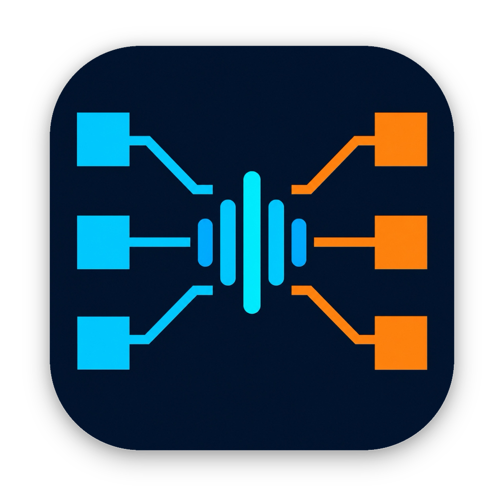
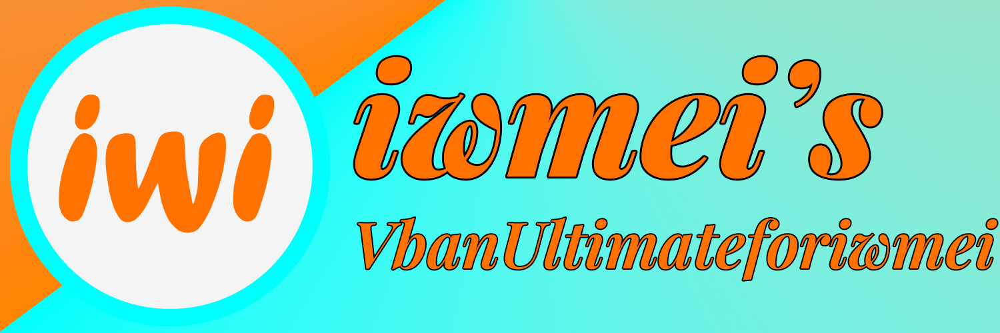
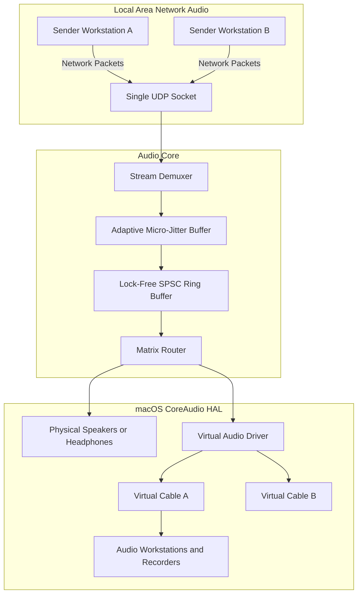

<div align="center">



# VBAN Ultimate for macOS



*Native lightweight ultra low latency broadcast VBAN audio routing matrix and CoreAudio dynamic virtual cable workstation built exclusively for Apple Silicon.*

[English](README_EN.md) · [简体中文](README.md)

[](https://apple.com/macos)
[](https://apple.com)
[](Core/)
[](App/)

</div>

---

VBAN Ultimate is an infrastructure grade professional audio utility that bridges VBAN network streaming and macOS CoreAudio hardware abstraction layer. Operating over a single standard network UDP port 6980, it provides full-duplex zero-copy multi-stream demultiplexing and transmission, dynamic virtual audio loopback cables that integrate directly with Audio MIDI Setup, and a broadcast crosspoint routing matrix.

---

## Quick Start

If you are using an AI coding assistant with terminal execution capabilities, simply prompt your agent:

```text
Help me install this repository: check macOS environment and Xcode command line tools, build and sign VBAN Ultimate, install the CoreAudio virtual driver, and deploy the application to /Applications.
```

> [!TIP]
> The AI agent will automatically verify toolchain dependencies, invoke the native build scripts, register the system driver, and configure necessary permissions without manual step-by-step terminal input.

---

## Traditional Start

### Option 1: Download Pre-built Release Disk Image

1. Head to the [Releases](https://github.com/yourpapayouknow/VbanUltimateforiwmei/releases) page and download `VBANUltimate-v1.0.0-macOS-arm64.dmg`.
2. Open the disk image and drag `VBANUltimate.app` into your `Applications` folder.
3. If using Virtual Audio Cables, run the driver installer script once in your terminal:
   ```zsh
   sudo ./Scripts/install_driver.zsh
   ```

### Option 2: Build and Install from Source

Clone the repository and run the automated Zsh scripts:

```zsh
# 1. Build the system-level CoreAudio HAL driver
./Scripts/build_driver.zsh

# 2. Install the driver to system plug-ins directory with administrator privileges
sudo ./Scripts/install_driver.zsh

# 3. Compile and sign the macOS application
./Scripts/build_app.zsh

# 4. Deploy permanently to system applications folder
cp -R build/VBANUltimate.app /Applications/
```

---

## Features

- Single-Port Multiplexing: Strict adherence to standard UDP port 6980, processing multiple concurrent audio streams without spawning redundant sockets.
- Crosspoint Routing Matrix: Mathematically aligned slot geometry with slot width of 96 points, featuring single-destination mutual exclusion and broadcast fan-out.
- Native CoreAudio HAL Dynamic Cables: High-performance system-level audio server plugin driver that appears natively in Audio MIDI Setup. Dynamic cable creation and property updates require no daemon restarts.
- Dual-Column Soundstage Meters: Horizontally paired stereo meters for multi-channel configurations. Hardware-backed fifty hertz metering accurately resting at negative infinity decibels during silence.
- Microsecond Jitter Absorption: Multi-tier adaptive jitter buffers, lock-free ring buffers, and real-time physical bandwidth and packet loss diagnostics.
- Smart Port Conflict Resolution: Never silently degrades when UDP 6980 is occupied. Provides one-click native inspection to safely take over the port with explicit user consent.
- Native Dark Bilingual Interface: Built entirely with SwiftUI, respecting dark industrial aesthetics and offering instant hot-switching between English and Simplified Chinese.

---

## System Architecture



---

## System Requirements

- Operating System: macOS 13.0 or later, including macOS 14 Sonoma and macOS 15 Sequoia.
- Hardware Architecture: Apple Silicon M1 or later.
- Toolchain: Xcode Command Line Tools providing compilers clang++ and swiftc.

---

## Verification & Testing

The repository contains an automated verification suite written in C++20 and Swift:

```zsh
# Protocol parser and boundary checks
clang++ -std=c++20 -O2 Tests/TestVBANParser.cpp -o bin/test_vban_parser && ./bin/test_vban_parser

# Local multi-stream UDP loopback test
clang++ -std=c++20 -O2 Tests/TestNetworkLoopback.cpp -o bin/test_network_loopback && ./bin/test_network_loopback

# Lock-free SPSC ring buffer concurrency test
clang++ -std=c++20 -O2 Tests/TestRingBuffer.cpp -o bin/test_ring_buffer && ./bin/test_ring_buffer

# CoreAudio hardware enumeration test
clang++ -std=c++20 -O2 -framework CoreAudio -framework CoreFoundation Tests/TestAudioDeviceCatalog.cpp -o bin/test_device_catalog && ./bin/test_device_catalog

# Sine wave audio reconstruction test
clang++ -std=c++20 -O2 Tests/TestAudioLoopback.cpp -o bin/test_audio_loopback && ./bin/test_audio_loopback

# Dynamic cable lifecycle and persistence test
clang++ -std=c++20 -O2 -framework CoreAudio -framework CoreFoundation Tests/TestCableManager.cpp -o bin/test_cable_manager && ./bin/test_cable_manager

# Audio matrix router fan-out test
clang++ -std=c++20 -O2 -framework CoreAudio -framework CoreFoundation Tests/TestMatrixRouter.cpp -o bin/test_matrix_router && ./bin/test_matrix_router
```
